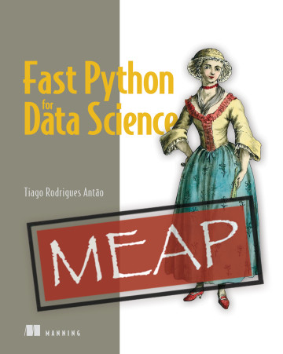

# High Performance Python for Data Analytics

Welcome to the code repository for the book [_High Performance Python
for Data
Analytics_](https://www.manning.com/books/high-performance-python-for-data-analytics)

High Performance Python for Data Analytics is your guide to optimizing
every part of your Python-based data analysis process, from the pure
Python code you write to managing the resources of modern hardware and
GPUs. You'll learn to rewrite inefficient data structures, improve
underperforming code with multithreading, and simplify your datasets
without sacrificing accuracy.

Here you can find the code for the book. Here is a chapter-oriented
roadmap. **Given that the book is in early access, the repo is also
under construction**

# Efficient computation

## Extracting maximum performance from built-in features

### [Introducing the project dataset](code/02-python/sec1-dataset)
### [Profiling code to detect performance bottlenecks](code/02-python/sec2-profiling)
### [Optimizing basic data structures for speed: lists, sets, dictionaries](code/02-python/sec3-basic-ds)
### [Finding excessive memory allocation](code/02-python/sec4-memory)
### [Using laziness and generators for big-data pipelining](code/02-python/sec5-lazy)

## Concurrency in Python

### [Writing the scaffold of an asynchronous server](code/03-concurrency/sec1-async)
### [Implementing the first MapReduce engine](code/03-concurrency/sec2-naive)
### [Implementing a concurrent version of a MapReduce engine](code/03-concurrency/sec3-thread)
### [Using multi-processing to implement MapReduce](code/03-concurrency/sec4-multiprocess)
### [Tying it all together: an asynchronous multi-threaded and multi-processing MapReduce server](code/03-concurrency/sec5-all)

## Using NumPy more efficiently

### [Understanding NumPy from a performance perspective](code/04-numpy/sec1-basics)
### [Using array programming](code/04-numpy/sec2-views)
### [Tuning NumPy's internal architecture for performance](code/04-numpy/sec3-vectorize)

## Re-implementing critical parts with Cython

## Efficient Pandas with Apache Arrow

# Efficient Storage

##  Understanding the impact of CPU and storage hierarchy in Python programs

## Understanding file system limitations and advantages

## Efficient persistent storage of large amounts of data with Python 

# Advanced topics

## GPU computing with Python

## Sub-sampling and simplifying data to improve performance

# Appendixes

## A deep dive into Python built-in data structures

## [A Cython primer](code/A03-cython)

### The Python-native implementation
### The Cython version

