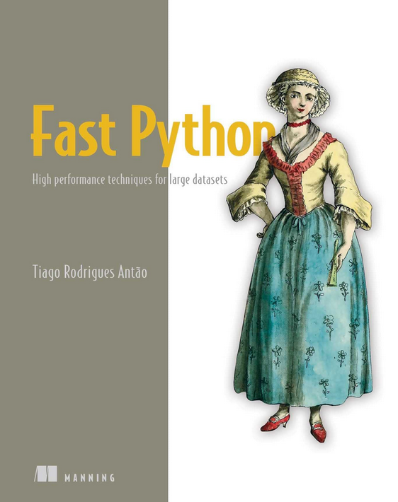

# Fast Python for Data Science

Welcome to the code repository for the book [_Fast Python_](https://www.manning.com/books/fast-python)

Fast Python is your guide to optimizing
every part of your Python-based data analysis process, from the pure
Python code you write to managing the resources of modern hardware and
GPUs. You'll learn to rewrite inefficient data structures, improve
underperforming code with multithreading, and simplify your datasets
without sacrificing accuracy.

Here you can find the code for the book. Here is a chapter-oriented
roadmap. **Given that the book is in early access, the repo is also
under construction**

# Introduction

## Extracting maximum performance from built-in features

- [Profiling applications with both IO and computing workloads](02-python/sec1-io-cpu)
- [Profiling code to detect performance bottlenecks](02-python/sec2-cpu)
- [Optimizing basic data structures for speed: lists, sets, dictionaries](02-python/sec3-basic-ds)
- [Finding excessive memory allocation](02-python/sec4-memory)
- [Using laziness and generators for big-data pipelining](02-python/sec5-lazy)

## Concurrency, parallelism, and asynchronous processing

- [Writing the scaffold of an asynchronous server](03-concurrency/sec1-async)
- [Implementing the first MapReduce engine](03-concurrency/sec2-naive)
- [Implementing a concurrent version of a MapReduce engine](03-concurrency/sec3-thread)
- [Using multi-processing to implement MapReduce](03-concurrency/sec4-multiprocess)
- [Tying it all together: an asynchronous multi-threaded and multi-processing MapReduce server](03-concurrency/sec5-all)

## Using NumPy more efficiently

- [Understanding NumPy from a performance perspective](04-numpy/sec1-basics)
- [Using array programming](04-numpy/sec2-views)
- [Tuning NumPy's internal architecture for performance](04-numpy/sec3-vectorize)

# Extracting maximum efficiency of hardware and networks

## Re-implementing critical code with Cython

- [A whirlwind tour of Cython](05-cython/sec2-intro)
- [Profiling Cython code](05-cython/sec3-profiling)
- [Optimizing array access with Cython memoryviews](05-cython/sec4-memoryview)
- [Writing NumPy generalized universal functions in Cython](05-cython/sec5-ufunc)
- [Advanced array access in Cython](05-cython/sec6-quadlife)
- [Parallelism in Cython](05-cython/sec7-parallel)

## Memory hierarchy, storage and networking

- [How modern hardware architectures impact Python performance](06-hardware/sec1-arch)
- [Efficient data storage with Blosc](06-hardware/sec2-blosc)
- [Accelerating NumPy with NumExpr](06-hardware/sec3-numexpr)
- [The performance implications of using the local network](06-hardware/sec4-network)

# Optimizing modern data processing libraries

## High performance Pandas and Apache Arrow

- [Optimizing memory and time when loading data](07-pandas/sec1-intro)
- [Techniques to increase data analysis speed](07-pandas/sec2-speed)
- [Pandas on top of NumPy, Cython and NumExpr](07-pandas/sec3-numpy-numexpr-cython)
- [Reading data into Pandas with Arrow](07-pandas/sec4-arrow-intro)
- [Using Arrow interop to delegate work to moere efficient languages and systems](07-pandas/sec5-arrow-plasma)

## Storing big data

- [A unified interface for file access: fsspec](08-persistence/sec1-fsspec)
- [Parquet: an efficient format to store columnar data](08-persistence/sec2-parquet)
- [Dealing with larger than memory datasets the old-fashioned way](08-persistence/sec3-chunk)
- [Zarr for large array persistence](08-persistence/sec4-zarr)

# Advanced topics

## Data analysis using GPU computing

- [Using Numba to generate CPU code](09-gpu/sec2-numba) XXX sec3-real
- [Performance analysis of GPU code: the case of a CuPy application](09-gpu/sec4-cupy)

## Analyzing big data with Dask

- [Understanding the execution model of Dask](10-dask/sec1-exec)
- [The computational cost of Dask operations](10-dask/sec2-perf)
- [Using Dask's distributed scheduler](10-dask/sec3-sche)

# Appendixes

## Setting up the environment

## [Using Numba to generate efficient low level code](A02-numba)
